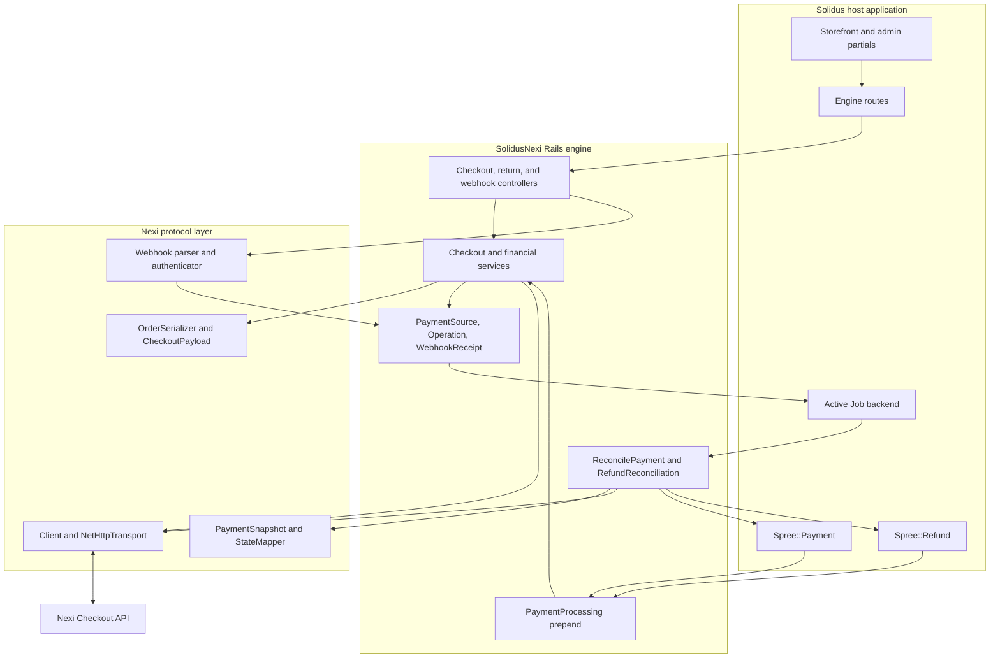
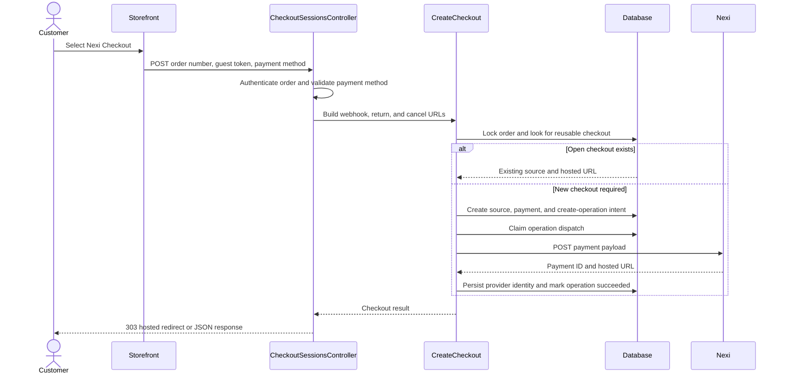
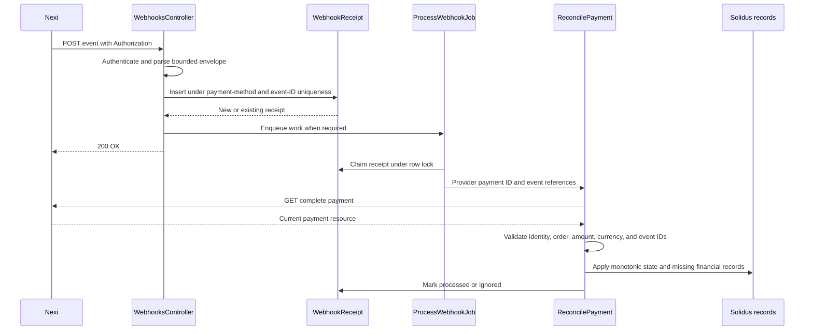
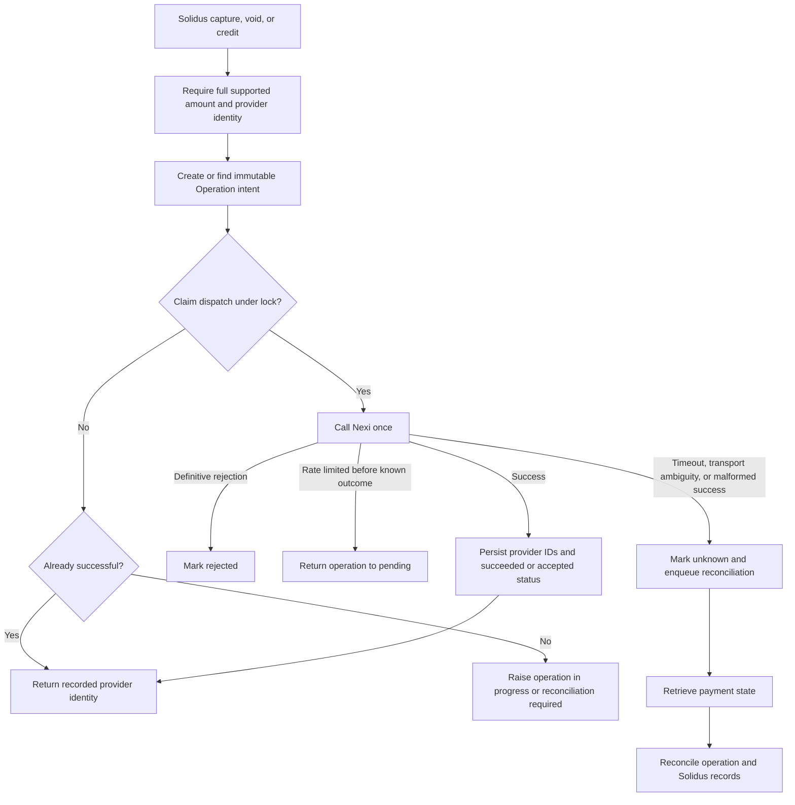
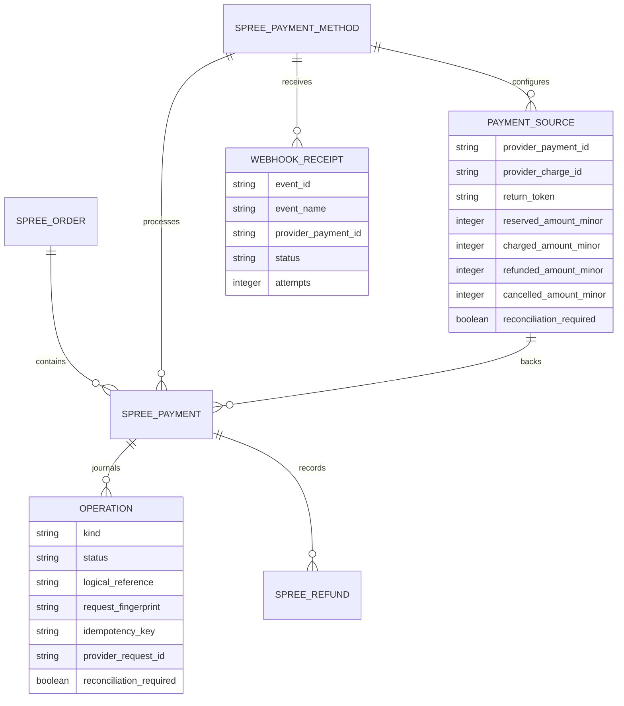
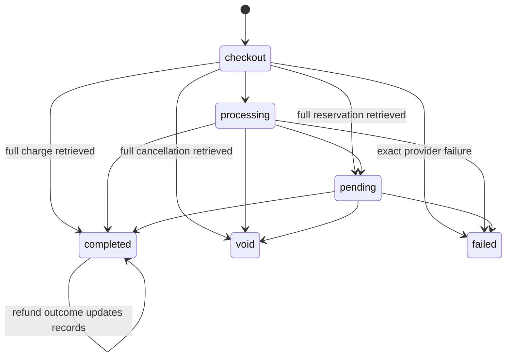

# Solidus Nexi architecture and code map

This document maps the engine's runtime paths and ownership boundaries. Nexi's retrieved payment resource is the financial source of truth. Browser returns and webhook bodies trigger retrieval; neither can directly mark a Solidus payment successful.

## Code map

| Area | Responsibility |
| --- | --- |
| `lib/solidus_nexi` | Gem entry point, configuration, engine wiring, public URL policy, and install generator. |
| `lib/solidus_nexi/nexi` | HTTP client, transport policy, typed errors, money conversion, canonical JSON, provider snapshots, state mapping, and webhook validation. This layer has no Solidus models. |
| `app/controllers/solidus_nexi` | Guest-token-protected checkout creation, opaque return tokens, authenticated webhook intake, and bounded HTTP responses. |
| `app/services/solidus_nexi` | Order serialization, checkout creation, capture, cancellation, refund, and provider-to-local reconciliation. |
| `app/models/solidus_nexi` | Solidus payment-method adapter plus durable provider identity, operation intent, amount snapshot, and webhook receipt records. |
| `app/jobs/solidus_nexi` | Retried provider retrieval and recovery of failed or stale webhook work. |
| `app/views/spree` | Solidus storefront, API, and admin integration partials. |
| `db/migrate` | Portable payment-source, operation-journal, and webhook-inbox tables. |
| `spec` | Unit, service, request, system, generator, task, and opt-in Nexi TEST contract coverage. |

## Checkout creation

Checkout creation is serialized under the order lock. An existing unexpired hosted page is reused only when its amount and canonical serialized order context still match. A same-total change to item identity, description, tax allocation, or shipping blocks the stale page and late reconciliation until it expires safely. A create request has no Nexi idempotency key, so an uncertain result blocks another checkout until the original is recovered or its 48-hour provider lifetime plus safety margin has elapsed.

## Return and webhook reconciliation

The browser return path also enqueues `ReconcilePaymentJob` before redirecting to the local storefront. Duplicate events are safe: the receipt's unique constraint deduplicates intake, and reconciliation compares cumulative provider amounts with existing Solidus capture and refund records.

## Financial mutations

Capture and refund persist Nexi idempotency keys per logical operation and may replay only that unchanged intent. Cancellation and checkout creation are not replayed after an uncertain outcome. Refund initiation is asynchronous: a successful POST is `accepted` until retrieval reports completion or failure.

## Local data model

`PaymentSource` holds the latest validated provider snapshot. `Operation` is an immutable-intent journal for external side effects. `WebhookReceipt` is a durable inbox; it stores the minimal event envelope rather than the complete request body.

## Payment state

Terminal payment states never move backwards. Unexpected partial amounts, mismatched references, and ambiguous refund outcomes leave the source flagged for reconciliation instead of guessing a state.

## Reliability boundaries

- Every provider response is parsed as a bounded JSON object and identifiers are format-checked before persistence.
- Provider mutations have no hidden transport retries. Unknown outcomes become durable operation state.
- The application stores minor currency units at the provider boundary and validates the supported currency set.
- Webhook Authorization accepts the current and one previous secret using constant-time comparison.
- Return tokens are random and independent of provider IDs; checkout creation requires the Solidus order guest token.
- Logs contain operation names, result classes, duration, and provider request IDs—not credentials, webhook Authorization values, or provider bodies.
- Background retrieval uses bounded retries, honors a safe `Retry-After` range, and can recover failed or stale webhook receipts from the database.

See [Operations](operations.md) for retry and incident procedures and [Testing](testing.md) for the executable coverage of these boundaries.
